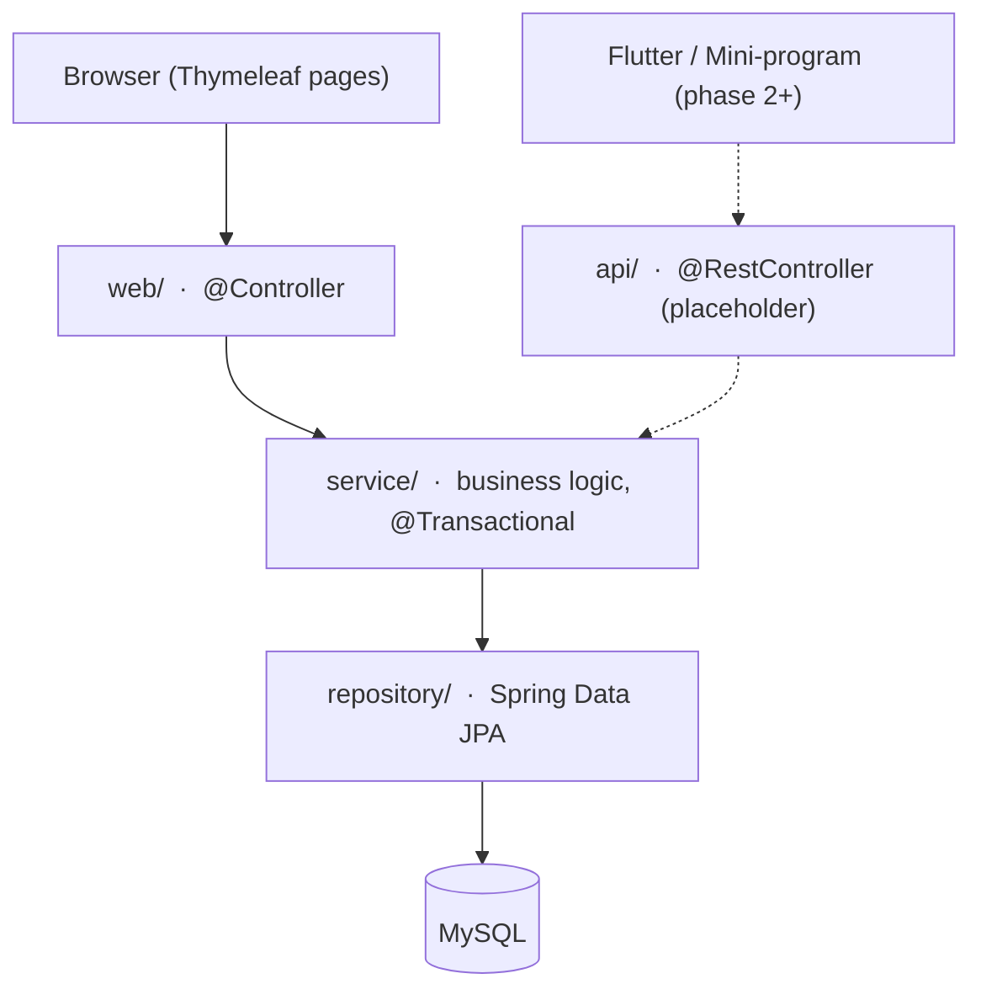

# MediSlot

**Book your slot, skip the wait.**

A clinic / community health center appointment-booking system. Server-rendered with Spring Boot and Thymeleaf, packaged as a monorepo so the same backend can later serve a mobile app and a mini-program.

[](LICENSE)
[](https://adoptium.net/)
[](https://spring.io/projects/spring-boot)
[](docker-compose.prod.yml)

---

## Overview

MediSlot is a small but complete appointment-booking workflow: patients browse doctors by department, pick a time slot, and book; doctors see their schedule for the day and move each visit through a status machine; slots are protected against over-booking with optimistic locking.

It is built as a **learning-oriented, production-shaped** project: a real layered architecture, a real database schema, real concurrency handling, and a real deployment path — without pulling in a frontend framework. Everything on the server is Java, and the UI is plain HTML + `th:` attributes.

The repository is a monorepo. Phase 1 ships a Thymeleaf web app; the `api/` package is intentionally left as a placeholder so the REST layer can be extracted only once the web app has proven which capabilities the clients actually need.

## Features

**Patients**

- Register and sign in with a phone number and password (session-based).
- Browse doctors, filtered by department.
- View a doctor's schedule for the next 7 days, with remaining slots per time block.
- Book an appointment with an optional reason for the visit.
- See all personal appointments grouped into *Pending / Completed / Cancelled*.
- Cancel a pending appointment; the slot is returned to the pool.

**Doctors**

- A "today" list of patients who booked them, ordered by time.
- Check a patient in (Pending → Checked-in).
- Mark a visit complete with an optional diagnosis note (Checked-in → Completed).

**Concurrency**

- Slot decrement uses a `@Version` optimistic lock plus a `booked_count < total_count` guard, so two patients cannot take the same last slot.

**Admin**

- A management console at `/admin`: a dashboard with live counts, plus management for departments, doctors (creating the login account at the same time), and schedules.
- Admins sign in through the same `/login` page and live in the unified `user` table (`role = ADMIN`) — no separate table or login URL.
- A default admin account is created idempotently on startup (overridable via `MEDISLOT_ADMIN_PHONE` / `MEDISLOT_ADMIN_PASSWORD`).

**Payment (simulated / sandbox)**

- Each doctor has their own registration fee; the fee is snapshotted onto the appointment at booking time.
- Booking creates an independent `payment` record (unpaid). The patient is sent to a checkout page and can pay within 30 minutes.
- Unpaid orders are voided automatically after the deadline (a scheduled task cancels the appointment and releases the slot).
- Cancelling a paid appointment triggers an automatic refund; cancelling an unpaid one voids the order.
- No real gateway is wired yet — the checkout is a self-contained mock, so the flow can be swapped to Alipay sandbox/production later without touching the surrounding logic.

**Pre-consultation (AI)**

- After payment, a **group chat** opens with the patient, the doctor, and an AI assistant. The AI talks to the patient (collects symptoms, gives general advice — never diagnoses or prescribes).
- The doctor does **not** chat with the AI in this window. Instead the doctor **directs** the AI (e.g. "produce a recent diet plan"); the AI returns a **draft**, and the doctor reviews it — approve / reject / adjust (adjust regenerates a new version).
- The doctor also has a **separate, private case-study window** to consult the AI about the case; it is invisible to the patient.
- The doctor can generate an AI **consultation summary** and close the session.
- The chat is **live**: the sender's message is sent over AJAX, the **AI reply streams in token by token (SSE)**, and the page polls for new messages every few seconds — no full-page reload, and the patient and doctor see each other's messages in near real time.
- **Structured intake**: the patient can fill a structured symptom form (chief complaint, symptoms, duration, severity, temperature, history, red flags). It is injected into the AI's context and shown to the doctor as a summary card.
- **Attachments**: patients and doctors can attach images (or PDFs, up to 5 MB) to a message; images render inline, other files as links. Files are stored on a mounted volume and served only to the conversation's participants.
- Powered by the **DeepSeek** API (`deepseek-flash` by default, OpenAI-compatible). The API key is injected as a mounted secret, never in code or env vars. Without a key the app falls back to a built-in mock so the flow still works.

## Tech Stack

| Layer | Technology |
|-------|------------|
| Language | Java 25 (Temurin LTS) |
| Framework | Spring Boot 4.1, Spring MVC |
| View | Thymeleaf 3.1 + Bootstrap 5 |
| Persistence | Spring Data JPA / Hibernate 7 |
| Database | MySQL 8.4 (HikariCP) |
| Security | Spring Security 7 (form login + role-based access) |
| Validation | Jakarta Bean Validation |
| Build | Maven 3.10 (with wrapper) |
| Deploy | Docker Compose (app + database containers) |
| AI | DeepSeek (OpenAI-compatible chat completions) |

## Architecture



The rule is simple: business logic lives **only** in `service/`. `web/` and `api/` are thin adapters over the same services.

### Appointment status machine

```
PENDING ──▶ CHECKED_IN ──▶ COMPLETED
   │
   └──────▶ CANCELLED
```

`COMPLETED` and `CANCELLED` are terminal. Only a `PENDING` appointment can be cancelled or checked in; only a `CHECKED_IN` appointment can be completed.

## Project Structure

```
MediSlot/
├── apps/
│   └── backend/                  # Spring Boot application
│       ├── src/main/java/com/medislot/
│       │   ├── MediSlotApplication.java
│       │   ├── config/           # Security, dev data seeder
│       │   ├── web/              # @Controller — request adapters
│       │   ├── api/              # placeholder for the REST layer
│       │   ├── service/          # business logic (the only place it lives)
│       │   ├── repository/       # Spring Data JPA interfaces
│       │   ├── entity/           # JPA entities
│       │   ├── dto/              # request/response models
│       │   └── exception/        # business exceptions
│       └── src/main/resources/
│           ├── application*.yml  # profile-based configuration
│           ├── templates/        # Thymeleaf pages
│           └── static/css/       # design tokens + components
├── deploy/                       # Nginx reverse-proxy config + guide
├── docs/                         # api.md, db-schema.md
├── scripts/                      # init.sql, start scripts
├── docker-compose.yml            # local stack
├── docker-compose.prod.yml       # production stack
└── AGENTS.md                     # conventions for AI coding tools
```

## Getting Started

### Prerequisites

- **Java 25** (the Maven wrapper handles Maven itself)
- **MySQL 8** for local development — *or* just use Docker (see below)
- **Docker + Docker Compose** for the containerized path

### Option A — Run everything with Docker

The fastest way to see it running:

```bash
cp .env.example .env      # set your own passwords
docker compose up -d --build
docker compose logs -f app
```

Then open <http://localhost:8080>.

### Option B — Local development

```bash
# 1. Create the database
mysql -u root -p -e "CREATE DATABASE medislot_db DEFAULT CHARACTER SET utf8mb4;"

# 2. Point the app at it (edit credentials in application-dev.yml if needed)

# 3. Run (the dev profile is the default)
cd apps/backend
./mvnw spring-boot:run          # Windows: mvnw.cmd spring-boot:run
```

The `dev` profile auto-creates the schema (`ddl-auto=update`) and seeds demo data on first start.

### Demo accounts

| Role | Phone | Password |
|------|-------|----------|
| Admin | `13000000000` | `admin123` |
| Doctor | `13800000001` | `doctor123` |
| Patient | `13900000000` | `patient123` |

> These are development-only credentials created by the seeder. Never enable seeding in production.

### Running the tests

Tests run against an in-memory H2 database, so no MySQL is required:

```bash
cd apps/backend
./mvnw test
```

## Configuration

Configuration is split by Spring profile:

| File | Purpose |
|------|---------|
| `application.yml` | Shared defaults; `dev` is the fallback profile |
| `application-dev.yml` | Local development: `ddl-auto=update`, SQL logging, demo seed |
| `application-docker.yml` | Containers: reads datasource settings from environment variables |

## Deployment

`docker-compose.prod.yml` runs two containers — the Spring Boot app and MySQL — with the database **not** exposed to the host, the app bound to `127.0.0.1:8080`, and data persisted to a host directory. A reverse proxy (Nginx) terminates TLS and forwards to the app.

```bash
cp .env.prod.example .env.prod   # set strong passwords
docker compose --env-file .env.prod -f docker-compose.prod.yml up -d --build
```

See [`deploy/`](deploy/) for a ready-to-adapt Nginx reverse-proxy config and a detailed deployment guide (Chinese).

## Roadmap

| Phase | Scope | Status |
|-------|-------|--------|
| 1 | Spring Boot + Thymeleaf web app | ✅ Done |
| 2 | REST API (`api/`) + Flutter client | Planned |
| 3 | WeChat mini-program client | Later |

## Contributing

Issues and pull requests are welcome. This is a personal learning project, so expect a pragmatic review rather than a formal process. If you change business behavior, please add or update a test — `./mvnw test` must stay green.

Please keep the core architectural rule intact: **business logic belongs in `service/`**, and `web/` / `api/` stay as thin adapters.

## Documentation

- [`docs/tech-stack.md`](docs/tech-stack.md) — architecture, technology choices, and conventions
- [`docs/ui-design.md`](docs/ui-design.md) — the visual design system (Clinical Clean)
- [`docs/db-schema.md`](docs/db-schema.md) — database schema and entity relationships
- [`docs/api.md`](docs/api.md) — REST API contract (enabled in phase 2)

## License

Released under the [MIT License](LICENSE).
