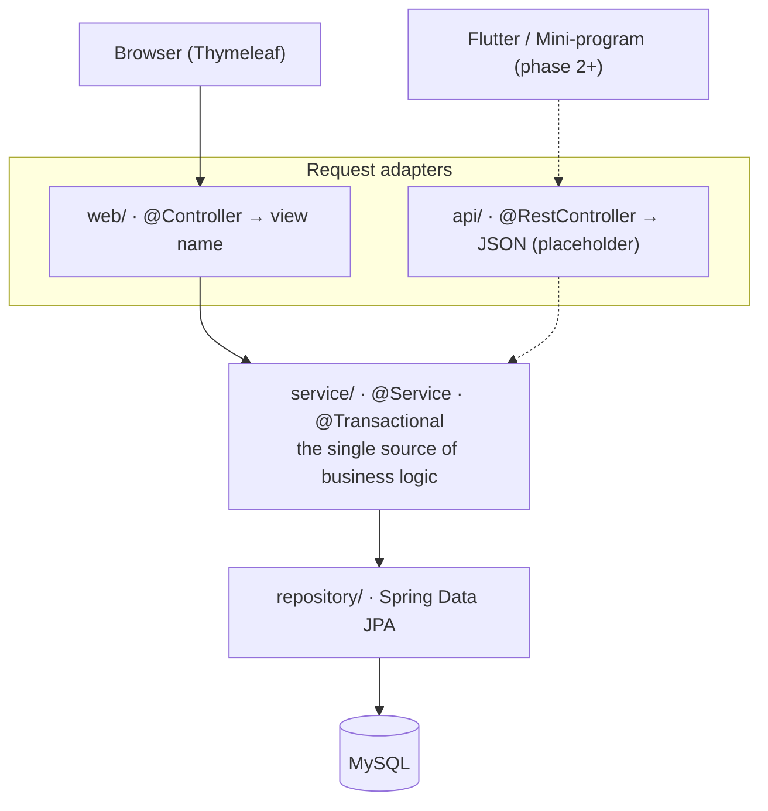

# MediSlot — Tech Stack

**Version:** 1.2.0
**Positioning:** A Java full-stack practice project — start with the web, then grow to multiple clients.
**Domain:** Clinic / community health center appointment booking.
**Repository shape:** Monorepo (one repository, multiple applications).

---

## 1. Project Overview

MediSlot is a clinic appointment-booking system managed as a **monorepo**: every client (web / Flutter / WeChat mini-program) shares a single Spring Boot backend.

**Core principles**

- Business logic is written **once**, in the `service/` layer.
- Every client is only a "request adapter + presentation layer" — no duplicated business rules.
- Phased delivery: web first, then Flutter, then the mini-program.

**Roadmap**

| Phase | Scope | Status |
|-------|-------|--------|
| **Phase 1** | Spring Boot + Thymeleaf web app | ✅ Done |
| **Phase 2** | Extract a REST API + Flutter mobile client | Planned |
| **Phase 3** | Native WeChat mini-program client | Later |

**Key constraint:** do **not** extract the API early. Add `@RestController`s under `api/` only once the web app works and real usage has validated which capabilities the clients need.

---

## 2. Technology Selection

### 2.1 Phase 1 (current)

| Layer | Technology | Version | Notes |
|-------|------------|---------|-------|
| **Language** | Java | 25 (Temurin LTS) | Latest LTS |
| **Framework** | Spring Boot | 4.1.x | Auto-configuration, embedded Tomcat |
| **Web layer** | Spring MVC | via Boot | `@Controller` handles page requests |
| **Template engine** | Thymeleaf | 3.1 | Server-side HTML rendering |
| **Persistence** | Spring Data JPA + Hibernate | 7.x | Auto-generated repositories |
| **Database** | MySQL | 8.4 | Mature and stable |
| **Connection pool** | HikariCP | via Boot | Default pool |
| **Security** | Spring Security | 7.x | Form login + role-based authorization |
| **Frontend styling** | Bootstrap 5 | 5.3 | Responsive, no heavy CSS |
| **Build tool** | Maven | 3.10 | Official support |

> **Note on Spring Security 7:** Thymeleaf's `sec:` dialect still ships as
> `thymeleaf-extras-springsecurity6`. It runs correctly against Spring Security 7
> (see the upstream compatibility discussion), so the project pins that artifact.

### 2.2 Introduced in later phases

| Phase | Technology | Notes |
|-------|------------|-------|
| **Phase 2** | Flutter | Patient app for iOS / Android |
| **Phase 2** | REST API | `@RestController`, unified response envelope |
| **Phase 3** | Native WeChat mini-program | `WXML` / `WXSS` / `JS` |

---

## 3. Architecture

### 3.1 Layered architecture



`web/` and `api/` are two adapters over the **same** service layer. Business logic is never duplicated.

### 3.2 Request flow (web phase)

1. Browser requests `GET /appointments/new`.
2. `web/AppointmentController` handles it and calls `service/AppointmentService`.
3. The controller returns `"appointment/form"` → Thymeleaf renders `templates/appointment/form.html`.
4. The user submits `POST /appointments`.
5. `@ModelAttribute` binds the form → the service applies business rules → the controller redirects or renders a result page.

### 3.3 Request flow (later API phase)

1. Flutter / mini-program requests `GET /api/doctors`.
2. `api/DoctorApiController` handles it and calls the **same** `service/DoctorService`.
3. It returns the unified envelope `{ code, message, data }`.

**Key point:** `web/` and `api/` are two adapters for one service — no duplicated logic.

---

## 4. Repository Layout

### 4.1 Phase 1

```
MediSlot/
├── README.md
├── LICENSE
├── AGENTS.md                       # conventions for AI coding tools
├── .gitignore
├── docker-compose.yml              # local stack
├── docker-compose.prod.yml         # production stack
├── apps/
│   └── backend/                    # Spring Boot application
│       ├── pom.xml
│       ├── Dockerfile
│       └── src/main/
│           ├── java/com/medislot/
│           │   ├── MediSlotApplication.java
│           │   ├── config/         # SecurityConfig, DataInitializer
│           │   ├── web/            # @Controller — Thymeleaf pages
│           │   ├── api/            # placeholder package for @RestController
│           │   ├── service/        # UserService, DoctorService,
│           │   │                   # ScheduleService, AppointmentService
│           │   ├── repository/     # Spring Data JPA interfaces
│           │   ├── entity/         # User, Department, Doctor,
│           │   │                   # Schedule, Appointment
│           │   ├── dto/            # AppointmentForm, DoctorCard,
│           │   │                   # ScheduleDayView, ApiResponse
│           │   └── exception/      # BusinessException
│           └── resources/
│               ├── application.yml
│               ├── static/css/
│               └── templates/      # layout.html, index.html,
│                                   # auth/, doctor/, appointment/
├── deploy/                         # Nginx reverse-proxy config + guide
├── docs/                           # tech-stack.md, ui-design.md,
│                                   # api.md, db-schema.md
└── scripts/                        # init.sql, start scripts
```

### 4.2 Future expansion

```
MediSlot/
├── apps/
│   ├── backend/                    # Spring Boot (unchanged)
│   ├── mobile/                     # Phase 2: Flutter
│   │   ├── lib/
│   │   └── pubspec.yaml
│   └── miniprogram/                # Phase 3: WeChat mini-program
│       ├── pages/
│       ├── app.js
│       ├── app.json
│       └── project.config.json
├── docs/
└── scripts/
```

> `mobile/` and `miniprogram/` are **not created yet** — they appear when those phases actually start.

---

## 5. Dependencies (Maven)

Core dependencies in `apps/backend/pom.xml`:

```xml
<!-- Web + Thymeleaf -->
<dependency>
    <groupId>org.springframework.boot</groupId>
    <artifactId>spring-boot-starter-web</artifactId>
</dependency>
<dependency>
    <groupId>org.springframework.boot</groupId>
    <artifactId>spring-boot-starter-thymeleaf</artifactId>
</dependency>

<!-- Data layer -->
<dependency>
    <groupId>org.springframework.boot</groupId>
    <artifactId>spring-boot-starter-data-jpa</artifactId>
</dependency>
<dependency>
    <groupId>com.mysql</groupId>
    <artifactId>mysql-connector-j</artifactId>
    <scope>runtime</scope>
</dependency>

<!-- Security -->
<dependency>
    <groupId>org.springframework.boot</groupId>
    <artifactId>spring-boot-starter-security</artifactId>
</dependency>
<dependency>
    <groupId>org.thymeleaf.extras</groupId>
    <artifactId>thymeleaf-extras-springsecurity6</artifactId>
</dependency>

<!-- Validation -->
<dependency>
    <groupId>org.springframework.boot</groupId>
    <artifactId>spring-boot-starter-validation</artifactId>
</dependency>

<!-- Developer tooling -->
<dependency>
    <groupId>org.springframework.boot</groupId>
    <artifactId>spring-boot-devtools</artifactId>
    <scope>runtime</scope>
    <optional>true</optional>
</dependency>

<!-- Tests (H2 in-memory database, no MySQL required) -->
<dependency>
    <groupId>com.h2database</groupId>
    <artifactId>h2</artifactId>
    <scope>test</scope>
</dependency>
```

---

## 6. Configuration

### 6.1 Profiles

Configuration is split by Spring profile:

| File | Purpose |
|------|---------|
| `application.yml` | Shared defaults; `dev` is the fallback profile |
| `application-dev.yml` | Local development: `ddl-auto=update`, SQL logging, demo seed |
| `application-docker.yml` | Containers: datasource settings from environment variables |

A representative `application.yml`:

```yaml
spring:
  datasource:
    url: jdbc:mysql://localhost:3306/medislot_db?serverTimezone=Asia/Shanghai&characterEncoding=UTF-8
    username: your_username
    password: your_password
    driver-class-name: com.mysql.cj.jdbc.Driver
    hikari:
      maximum-pool-size: 10
      minimum-idle: 2

  jpa:
    hibernate:
      ddl-auto: update          # auto-create tables in development
    show-sql: true
    properties:
      hibernate:
        format_sql: true

  thymeleaf:
    cache: false                # disable cache during development
    prefix: classpath:/templates/
    suffix: .html
    encoding: UTF-8

server:
  port: 8080
```

### 6.2 Development vs. production

| Setting | Development | Production |
|---------|-------------|------------|
| `ddl-auto` | `update` | `validate` (see note) |
| `thymeleaf.cache` | `false` | `true` |
| `show-sql` | `true` | `false` |

> **Note:** the current Docker profile still uses `update` while the schema is
> stabilizing. Switch to `validate` (plus `scripts/init.sql` or a migration tool)
> once the tables are frozen.

---

## 7. Conventions (`AGENTS.md`)

The repository root carries an `AGENTS.md` so AI coding tools follow the same rules:

- Business logic lives in `service/`; `web/` and `api/` are request adapters only.
- Database access goes through `repository/`; controllers and services never write SQL directly.
- The API response envelope is `{ code, message, data }` (`code = 0` means success).
- Naming: entities are singular nouns; `XxxRepository` / `XxxService` /
  `XxxController` (web) / `XxxApiController` (api); templates follow
  `templates/{module}/{action}.html`.
- Service methods that write to multiple tables must be `@Transactional`.
- Slot decrement uses an optimistic lock (`@Version` + a conditional update), not a pessimistic lock.

---

## 8. Mapping Core Scenarios to the Stack

Using the "patient books an appointment" path as an example:

| Step | Technology | Java skill exercised |
|------|------------|----------------------|
| List bookable doctors | `DoctorRepository.findByDepartmentId()` | JPA derived queries |
| Pick a time slot | `ScheduleRepository.findAvailable(...)` | `@Query` conditional queries |
| Submit an appointment | `@PostMapping` + `@ModelAttribute` | MVC form binding + `@Valid` |
| Conflict check | `AppointmentService.create(...)` | Business logic + `@Transactional` |
| Slot decrement | `Schedule` + `@Version` | Optimistic-lock concurrency control |
| My appointments | `AppointmentRepository.findByPatientIdOrderByCreatedAtDesc()` | JPA queries |
| Cancel an appointment | `AppointmentService.cancel(...)` | State-machine transitions |

---

## 9. Security Design

Phase 1 uses **Spring Security form login** — no JWT (that arrives with the Phase 2 clients).

- **Patients:** browse doctors, book appointments, view / cancel their own appointments.
- **Doctors / admins:** view the day's appointments, check patients in.

Authorization is enforced in two places:

1. **URL level** — `SecurityConfig` maps paths to roles (`/doctor/**` requires `DOCTOR`, `/appointments/**` requires `PATIENT`, `/admin/**` requires `ADMIN`).
2. **Data ownership** — services verify that the current user owns the record (e.g. a doctor may only modify appointments booked with them).

Thymeleaf uses the `sec:authorize` attribute to show or hide UI per role.

---

## 10. Phase 1 Checklist

1. Create the monorepo structure and initialize Git.
2. Write `AGENTS.md`, `README.md`, `.gitignore`.
3. Generate the `apps/backend` skeleton (Spring Initializr).
4. Configure `application.yml` and get the app to boot.
5. Design the tables: `user` / `department` / `doctor` / `schedule` / `appointment`.
6. Implement the minimal loop: **login → doctor list → pick a slot → book → my appointments**.
7. Iterate: cancellation, role separation, slot concurrency control.

> Until step 6 works end to end, don't touch the API, Flutter, or the mini-program.

---

## 11. Why This Stack Is Good for Practicing Java

1. **All business code is Java** — controllers, services, repositories, entities, config.
2. **Thymeleaf introduces no new language** — HTML plus `th:` attributes, no JavaScript framework.
3. **The Spring stack is exercised end to end** — MVC, Data JPA, Security, Validation, Transactions.
4. **The monorepo gives AI tools full context** — backend and frontend are understood together.
5. **Phasing wastes nothing** — the service layer written for the web is reused directly by Flutter and the mini-program.
